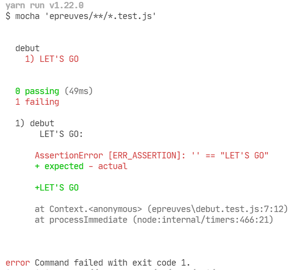

Dans ce TP, nous allons apprendre les bases de [l'un des langages les plus populaires](https://pypl.github.io/PYPL.html), le JavaScript. Pour cela, vous allez réaliser un "Koan", c'est-à-dire une suite de petites épreuves pour découvrir les fonctionnalités du langage.


# 1) Préparer l'environnement

Commencez par installer NodeJS en le téléchargeant sur [https://nodejs.org/](https://nodejs.org/). NodeJS permet d'exécuter du code JavaScript en dehors d'un navigateur. Il est fourni avec un outil de "gestion de dépendances" spécialement pour le JavaScript : npm. Celui-ci permet d'installer plein d'outils pour faciliter le développement.

D'ailleurs, on va l'utiliser pour installer un autre outil de gestion de dépendance plus puissant : yarn. Dans un terminal faire un `npm install --global yarn`.

Avec Yarn, on va installer "Mocha". Dans le terminal, si ça n'est pas déjà le cas, rendez-vous sur ce projet. Puis faite un `yarn add mocha -D`.

Mocha va lire les fichiers *.test.js, exécuter leur code et afficher une jolie interface pour suivre notre progression :). Pour cela, on va devoir le configurer. Dans [package.json](./package.json), modifier la section script pour avoir :
```json
  "scripts": {
    "test": "mocha 'epreuves/**/*.test.js'"
  } 
```

Il ne nous reste plus qu'à le lancer ! Dans le terminal faites un `yarn test`. Le message suivant doit s'afficher :

  
Vous avez la même chose ? Alors vous êtes prêt "répondre aux épreuves".

# 2) Répondre aux épreuves

Mocha nous indique la première épreuve :
- Ouvrez [./epreuves/0.debut.test.js](./epreuves/0.debut.test.js)
- L'épreuve consiste à remplacer REPONSE par une valeur, de sorte que la clause `assert.equal` soit valide.
- Relancer un `yarn test`, si vous avez mis la bonne réponse, le message suivant doit apparaître :


- Trop facile ? Ouvrez le fichier juste en dessous. Du code est commenté. Dé-commenté le pour activer la prochaine épreuve.
- Quand vus aurez trouvé toutes les solutions de tous les tests, vous aurez fini le TP :).


# Pour vous aider
- [openclassrooms](https://openclassrooms.com/fr/courses/6175841-apprenez-a-programmer-avec-javascript)
